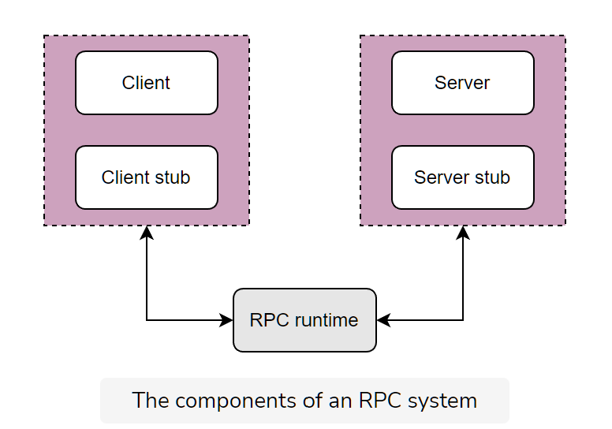
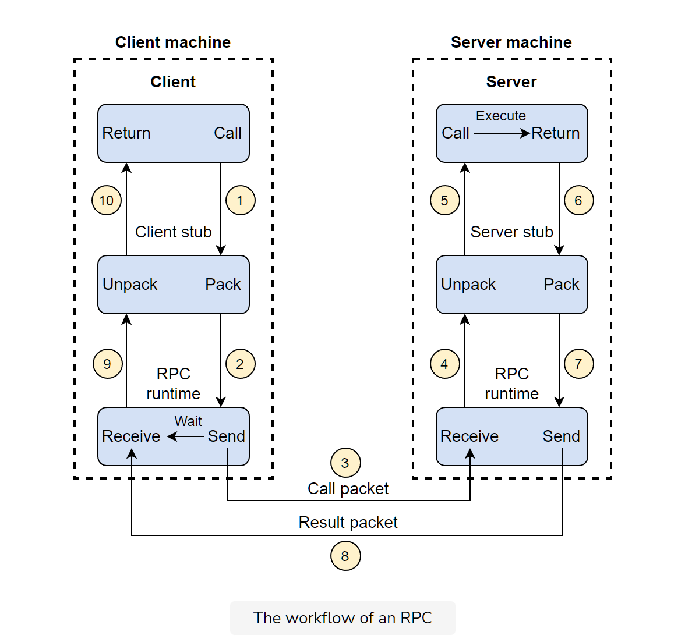

# [Grokking Modern System Design Interview for Engineers & Managers](https://www.educative.io/courses/grokking-modern-system-design-interview-for-engineers-managers)

## Takeaway - [Grokking Modern System Design Interview for Engineers \& Managers](#grokking-modern-system-design-interview-for-engineers--managers)
- [Grokking Modern System Design Interview for Engineers \& Managers](#grokking-modern-system-design-interview-for-engineers--managers)
  - [Takeaway - Grokking Modern System Design Interview for Engineers \& Managers](#takeaway---grokking-modern-system-design-interview-for-engineers--managers)
  - [Overview](#overview)
  - [Introduction](#introduction)
    - [**What is system design?**](#what-is-system-design)
    - [**Modern System Design Using Building Blocks**](#modern-system-design-using-building-blocks)
    - [**What will this course offer?**](#what-will-this-course-offer)
  - [Abstractions](#abstractions)
    - [**Abstractions: Why are they Important?**](#abstractions-why-are-they-important)
      - [**Database Abstractions**](#database-abstractions)
      - [**Abstractions In Distributed Systems**](#abstractions-in-distributed-systems)
    - [**Network Abstractions: Remote Procedure Calls (RPC)**](#network-abstractions-remote-procedure-calls-rpc)
      - [**What is an RPC?**](#what-is-an-rpc)
      - [**What is OSI Model?**](#what-is-osi-model)
      - [**How does RPC work?**](#how-does-rpc-work)
      - [**Summary**](#summary)

## Overview

Distributed systems are the standard to deploy applications and services.  Mobile and cloud computing combined with expanded internet access make system design a core skill for the modern developer.

This course provides a bottom-up approach to design scalable systems.  First, we learn about the building blocks of modern systems, with each component being a completely scalable application itself.  You'll then explore the RESHADED framework for architecting web-scale applications by determining requirements, constraints, and assumptions before diving into a step-by-step design process.  Finally, you'll design several popular services by using these modular building blocks in unique combinations

## Introduction

### **What is system design?**

- System design is the process of defining components and their integrations, APIs, and data models to build large-scale systems that meet a specified set of functional and non-functional requirements.
- System design uses the concepts of computer networking, parallel computing, and distributed systems to build scalable, reliable, and efficient systems.
- 
- System design aims to build systems that are reliable, effective, and maintainable, among other characteristics
  - **Reliable systems** handle faults, failures, and errors
  - **Effective systems** meet all user needs and business requirements
  - **Maintainable systems** are flexible and easy to scale up or down.  The ability to add new features also comes under the umbrella of maintainability

### **Modern System Design Using Building Blocks**

We have separated out commonly-used design elements, such as **load balancers**, as the basic building blocks for high-level system design.  This serves two purposes.  First, it allows us to discuss all the building blocks in detail and discuss their interesting mini-design problems.  Second, when we tackle a design problem, we can concentrate on problem-specific aspects, mention the building block we'll use, and how we'll use it.  This helps us remove duplicate discussions of commonly-occurring design elements.
We have identified **16 building blocks** that are crucial to designing modern systems

### **What will this course offer?**

1.  **A fresh look at system design:** Many system design courses provide a formula to attack a specific problem. This might seem attractive in a high-stress situation like an interview, but it might encourage memorizing a design solution instead of actually understanding the problem and devising an appropriate solution. If system design were that formulaic, then we probably wouldn’t need people for system designing. System design is as much an art as it is a science, and attacking a design problem from the first principles gives a fresh feel to it.
2.  **Going deep and broad**: We tackle some traditional problems, but with added in-depth discussions on them. We give proper rationale for why we use some components despite their tradeoffs. For example, we explain why we use a particular **database**, a **caching system**, or a **load balancing** technique in a design.
  We address some new design problems as well that touch upon not only **scalability** but also **availability**, **maintainability**, **consistency**, and **fault-tolerance**. Collectively, traditional and new problems cover all aspects of modern system design activity. Our hope is that this course prepares learners to effectively tackle any new design problem they encounter.
  Real systems are complex and, often, we might need to make appropriate assumptions to properly scope a problem. We cover problems in more detail to properly grasp the real-world systems.
3. **Iterative process:** Systems, in reality, improve over iterations. We often start with something simple, but when bottlenecks arise in one or more of the system’s parts, a new design becomes necessary. In some design problems, we make one design, identify bottlenecks, and improve on it. Working under time constraints might not permit iterations on the design. However, we still recommend two iterations—first, where we do our best to come up with a design (that takes about 80 percent of our time), and a second iteration for improvements. Another choice is to change things as we figure out new insights. Inevitably, we discover new details as we spend more time working with a problem.
4. **Interactive learning:** We provide ample opportunities to get experience with system design. Some design problems guide learners through many steps to design a system. We also have a few examples where the learner designs the full system end-to-end without any guided steps. We reinforce the important concepts by testing learners with questions and quizzes.

## Abstractions

### **Abstractions: Why are they Important?**

**Abstraction** is the art of obfuscating details that we don't need.  It allows us to look at the bigger picture.  Looking at the bigger picture is vital because it hides the inner complexities, thus giving us a broader understanding of our set goals and staying focused on them

In the context of computer science, we all use computers for our work, but we don’t start making hardware from scratch and developing an operating system. We use that for the purpose at hand rather than digging into building the system.

The developers use a lot of libraries to develop the big systems. If they start building the libraries, they won’t finish their work. Libraries give us an easy interface to use functions and hide the inside detail of how they are implemented. A good abstraction allows us to reuse it in multiple projects with similar needs.

#### **Database Abstractions**

**Transactions** is a database abstraction that hides many problematic outcomes when concurrent users are reading, writing, or mutating the data and gives a simple interface of commit, in case of success, or abort, in case of failure.  Either way, the data moves from one consistent state to a new consistent state.  The transactions enables end users to not be bogged down by the subtle corner-cases of concurrent data mutation, but instead focus on the business logic.

#### **Abstractions In Distributed Systems**

Abstractions in distributed systems help engineers simplify their work and relieve them of the burden of dealing with the underlying complexity of the distributed systems.

The abstraction of distributed systems has grown in popularity as many big companies like Amazon AWS, Google Cloud, and Microsoft Azure provide distributed services. Every service offers different levels of agreement. The details behind implementing these distributed services are hidden from the users, thereby allowing the developers to focus on the application rather than going into the depth of the distributed systems that are often very complex.

Today’s applications can’t remain responsive/functional if they’re based on a single node because of an exponentially growing number of users. Abstractions in distributed systems help engineers shift to distributed systems quickly to scale their applications.

### **Network Abstractions: Remote Procedure Calls (RPC)**

**Remote Procedure Calls (RPCs)** provide an abstraction of a local procedure call to the developers by hiding the complexities of packing and sending function arguments to the remote server, receiving the return values, and managing any network retries

#### **What is an RPC?**

**RPC** is an interprocess communication protocol that's widely used in distributed systems.  In the OSI model of network communication, RPC spans the transport and application layers.  RPC mechanisms are employed when a computer program causes a procedure or subroutine to execute in a separate address space.  The procedure or subroutine is coded as a regular/local procedure call without the programmer explicitly coding the details for the remote interaction.

#### **What is OSI Model?**

The **OSI** model, or **Open Systems Interconnection** model, is a framework for understanding how communication occurs between different computer systems. It was developed by the **International Organization for Standardization (ISO)** in the 1980s as a way to standardize communication protocols and make it easier for different computer systems to communicate with one another.

The OSI model consists of seven layers, each of which serves a specific function in the communication process. These layers are:

- **Physical**: This layer defines the physical characteristics of the communication medium, such as *cables* and *connectors*.
- **Data link**: This layer establishes and maintains connections between devices, and ensures that data is transmitted properly between them.
- **Network**: This layer routes data between devices on a network.
- **Transport**: This layer ensures that data is delivered reliably and in the correct order.
- **Session**: This layer establishes, maintains, and terminates connections between devices.
- **Presentation**: This layer translates data into a format that can be understood by the application layer.
- **Application**: This layer provides the interface between the communication software and the end user.
Each layer communicates with the layer above and below it, and each layer performs a specific set of functions to support the communication process.

#### **How does RPC work?**

When we make a remote procedure call, the calling environment is paused and the procedure parameters are sent over the network to the environment where the procedure is to be executed.  When the procedure execution finished, the results are returned to the calling environment where the executions restarts as a regular procedure call.

To see how this work, let's take an example of a client-server program.  There are five main components involved in the RPC program, as shown here:

The client, the client stub, and one instance of RPC runtime are running on the client machine. The server, the server stub, and one instance of RPC runtime are running on the server machine.

During the RPC process, the following steps occur:

1. A **client** initiates a **client stub process** by giving parameters as normal. The **client stub** is stored in the address space of the client.
2. The client stub converts the parameters into a standardized format and packs them into a message. After packing the parameter into a message, the client stub requests the local RPC runtime to deliver the message to the server.
3. The RPC runtime at the client delivers the message to the server over the network. After sending a message to the server, it waits for the message result from the server.
4. RPC runtime at the server receives the message and passes it to the server stub.

  Note: The RPC runtime is responsible *for transmitting messages between client and server via the network*. The responsibilities of RPC runtime also include **retransmission**, **acknowledgment**, and **encryption**.

5. The server stub unpacks the message, takes the parameters out of it, and calls the desired server routine, using a local procedure call, to do the required execution.

  

6. After the server routine has been executed with the given parameters, the result is returned to the server stub.
7. The server stub packs the returned result into a message and sends it to the RPC runtime at the server on the transport layer.
8. The server’s RPC runtime returns the packed result to the client’s RPC runtime over the network.
9. The client’s RPC runtime that was waiting for the result now receives the result and sends it to the client stub.
10. The client stub unpacks the result, and the execution process returns to the caller at this point.
  - **Note**: Back-end services use RPC as a communication mechanism of choice due to its high performance and simple abstraction of calling remote code as local functions

#### **Summary**

The RPC method is similar to calling a local procedure, except that the called procedure is usually executed in a different process and on a different computer.

RPC allows developers to build applications on top of distributed systems. Developers can use the RPC method without knowing the network communication details. As a result, they can concentrate on the design aspects, rather than the machine and communication-level specifics.
